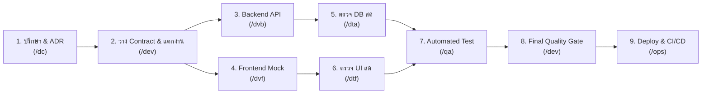

# 🤖 AGENTS.md - Project AI Constitution & Collaboration Rules

> **เอกสารข้อตกลงและกฎเหล็กการทำงานร่วมกันระหว่าง Developer และ AI Agents**  
> เอกสารฉบับนี้เป็น Single Source of Truth ที่ AI Agents ทุกตัว (Antigravity, Cursor, Copilot) ต้องอ่านและปฏิบัติตามอย่างเคร่งครัด

---

## 🏛️ 1. ทีมงานและสารบัญ Slash Commands (Team Directory)

เมื่อต้องการสั่งงานตามบทบาท ให้ใช้คำสั่งเฉพาะทางเหล่านี้:

| คำสั่ง | บทบาทหน้าที่ (Role) | จุดประสงค์การใช้งาน |
| :---: | :--- | :--- |
| **`/dc`** | **Senior Consultant & Architect** | ปรึกษาโจทย์, วางสถาปัตยกรรม, วิเคราะห์ Trade-offs, บันทึก ADR ลง `docs/adr/` |
| **`/dev`** | **Lead Developer & Orchestrator** | แตกแผนงาน Sub-tasks, คุม Contract-First, สั่งการลูกทีม, คุม Quality Gate |
| **`/dvb`** | **Backend Developer Specialist** | สร้าง Schema, Migration, API Logic, Typed Env (`zod`), Health Probes (`/healthz`) |
| **`/dta`** | **Live API & DB Testing Specialist** | ยิง HTTP จริงเข้า Endpoint, Query ตรวจสอบ Record ใน DB, ทดสอบ Validation & Schema |
| **`/dvf`** | **Frontend Developer Specialist** | สร้าง UI Components, Design System, State Management, Parallel Mocking (MSW) |
| **`/dtf`** | **Live Frontend & UI Testing Specialist**| ทดสอบ Form Validation, 4 UI States, Responsive Viewports (375px), ดัก Console Errors |
| **`/qa`** | **QA & Test Automation Specialist** | เขียน Unit, Integration, E2E Test Suites (`*.spec.ts`) ป้องกัน Regression ใน CI |
| **`/ops`** | **DevOps & Cloud Specialist** | จัดการ Dockerfile (Multi-stage), CI/CD (GitHub Actions), Git Hooks (Husky), Secret Shield |

---

## ⚖️ 2. กฎเหล็กที่ห้ามละเมิดเด็ดขาด (Non-Negotiable Rules)

1. **ห้าม Commit Secrets**: ห้ามฮาร์ดโค้ด Password, API Key, Token, หรือ Private Credentials ลงในโค้ดหรือ Git โดยเด็ดขาด ให้ใช้ `.env.example` เสมอ
2. **Contract-First ก่อนลงมือเขียนโค้ด**: ก่อนที่ `/dvb` หรือ `/dvf` จะเริ่มเขียนฟีเจอร์ ต้องมี Data Contract ที่ตกลงกันใน `docs/API_SPEC.md` ก่อนเสมอ
3. **ห้ามบายพาส Type Check**: ห้ามใช้ `any` ใน TypeScript หรือปิด Type Checking ทุกไฟล์ต้องรันผ่าน `tsc --noEmit` (หรือ linter ของภาษา) ด้วย 0 errors
4. **ความสมบูรณ์ของ 4 UI States**: ทุก Component หรือหน้าที่ดึงข้อมูลจาก API ต้องรองรับครบทั้ง 4 สถานะ: **Loading, Empty, Error, Success** เสมอ
5. **Database Safety**: ห้ามแก้ไฟล์ Migration เก่าที่เคยรันไปแล้ว ให้สร้าง Migration ไฟล์ใหม่ต่อท้ายเสมอ และต้องรองรับ Rollback ได้
6. **Teardown ข้อมูลทดสอบ**: เมื่อ `/dta` ทดสอบยิง API เข้า Database จริง ต้องมีขั้นตอน Clean up ล้าง Record ขยะออกหลังทดสอบเสร็จเสมอ
7. **Caveman Style & Table Format**: ตอบสั้น กระชับ ตรงประเด็นแบบ Caveman (ตัดคำเยิ่นเย้อ สรุปเนื้อๆ) และแสดงผลลัพธ์/การเปรียบเทียบ/สถานะเป็น Markdown Table เสมอ
8. **Token Efficiency & Direct File Edits**: ห้ามพิมพ์ Full Code ยาวๆ ในแชท ให้เขียนหรือแก้ไขลงไฟล์จริงโดยตรง ในแชทให้สรุปเฉพาะตาราง Diff, สถานะ, และ File Link เท่านั้น

---

## ⚡ 3. เวิร์กโฟลว์การทำงานมาตรฐาน (Standard Execution Flow)

---

## 📂 4. โครงสร้างเอกสารอ้างอิงสำคัญ (Project Docs Structure)

- `docs/ARCHITECTURE.md` : สถาปัตยกรรมและภาพรวมของระบบ
- `docs/API_SPEC.md` : Data Contract กลางระหว่างหน้าบ้านและหลังบ้าน
- `docs/TASK_LIST.md` : รายการ Sub-tasks และสถานะความคืบหน้า
- `docs/CODING_STANDARDS.md` : กฎและข้อตกลงการเขียนโค้ด
- `docs/adr/` : Architecture Decision Records (เก็บบันทึกการตัดสินใจทางสถาปัตยกรรม)
