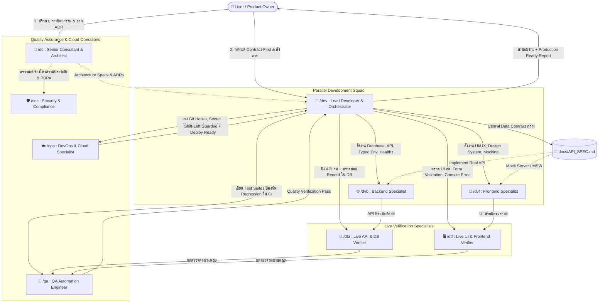
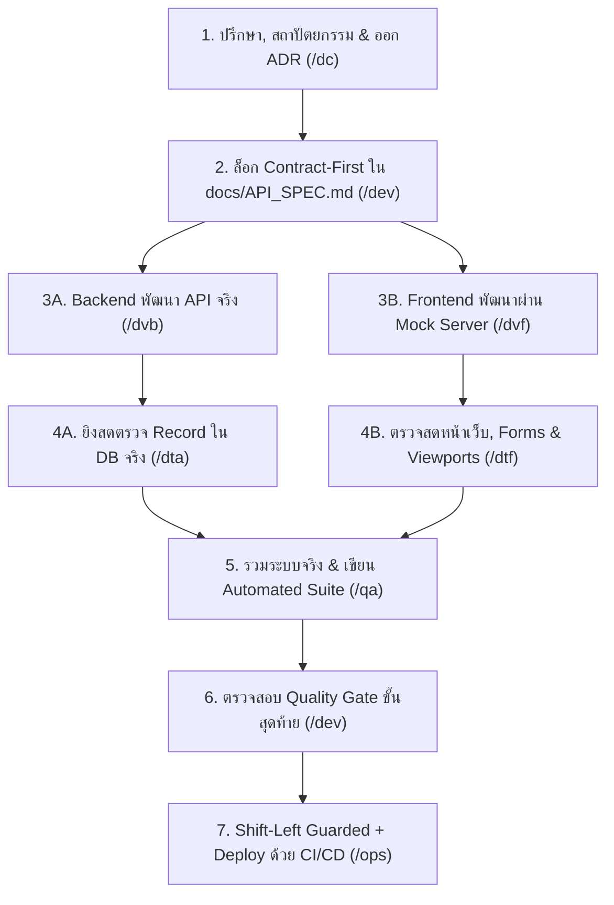

# 🧭 AI Skills Framework & Team Orchestration Template (Enterprise v3.0)

> **เอกสารคู่มือแม่แบบมาตรฐานการจัดโครงสร้างทีม AI Agents (Skills Framework Template)**  
> แม่แบบสากลระดับ Enterprise สำหรับนำไปใช้เป็นมาตรฐานในการพัฒนาซอฟต์แวร์ทุกโปรเจกต์ ครบวงจรทั้งการวางสถาปัตยกรรม (ADR), การทำงานคู่ขนาน (Contract-First & Mocking), การตรวจสอบสด (Live Verifiers), และระบบป้องกันข้อผิดพลาดอัตโนมัติ (Shift-Left & Secret Shield)

---

## 🏛️ 1. โครงสร้างและสายการบังคับบัญชา (Team Hierarchy)



---

## 📋 2. รายละเอียดบทบาทของแต่ละ Skill (Skills Summary Matrix)

| Skill | ชื่อบทบาท (Role) | สไตล์และบทบาท (Persona & Style) | ความรับผิดชอบหลัก (Core Responsibilities) | เอกสารอ้างอิงหลัก (Pre-Flight Docs) |
| :---: | :--- | :--- | :--- | :--- |
| **`/dc`** | **Senior Consultant & Architect** | **Strategic & Decisive**<br>• สั้น ตรงประเด็น ฟันธงชัดเจน<br>• บันทึก ADR สถาปัตยกรรม | • ออกแบบ System Architecture, Data Flow<br>• วิเคราะห์ Trade-offs, Scalability, Cost<br>• สืบหาสาเหตุของบั๊กหรือปัญหาคอขวด<br>• **สร้าง Architecture Decision Records (`docs/adr/`)** | • `docs/ARCHITECTURE.md`<br>• `docs/adr/TEMPLATE.md` |
| **`/dev`** | **Lead Developer & Orchestrator** | **Tech Lead & Coordinator**<br>• สั่งการเป็น Checklists ชัดเจน<br>• ยึดมั่น Contract-First | • แตก Requirement เป็น Sub-tasks<br>• **ล็อก Data Contract ใน `docs/API_SPEC.md` ก่อนเริ่มเขียนโค้ด**<br>• สั่งการ `/dvb`, `/dta`, `/dvf`, `/dtf`, `/qa`<br>• ควบคุม Quality Gate ขั้นสุดท้ายก่อนส่งมอบงาน | • `docs/TASK_LIST.md`<br>• `docs/API_SPEC.md`<br>• `docs/CODING_STANDARDS.md` |
| **`/dvb`** | **Backend Developer Specialist** | **Data Integrity & Robust APIs**<br>• เคร่งครัดเรื่อง Type Safety, Security<br>• Typed Env & Health Probes | • ออกแบบ Database Schema & Migrations<br>• พัฒนา Business Logic, Services, APIs ตาม Contract<br>• **ตรวจสอบ Env ด้วย Schema Validation (Zod) ตั้งแต่เริ่มบูต**<br>• **สร้าง Health Probes (`/healthz`, `/readyz`) สำหรับ Cloud** | • `docs/DATABASE_SCHEMA.md`<br>• `docs/API_SPEC.md`<br>• `.env.example` |
| **`/dta`** | **Live API & DB Testing Specialist** | **Runtime Verifier & Edge Hunter**<br>• ยิง HTTP จริง เปิดดู DB สดๆ<br>• จอมจับผิด Validation & Schema | • ยิง Request จริงทดสอบ API Endpoint<br>• Query ตรวจสอบความถูกต้องของ Record ใน DB โดยตรง<br>• ยิง Negative Cases (Body ไม่ครบ, ผิด Type, Token ปลอม)<br>• **ล้างข้อมูลทดสอบ (Teardown) ให้สะอาดทุกครั้ง** | • `docs/API_SPEC.md`<br>• `docs/DATABASE_SCHEMA.md` |
| **`/dvf`** | **Frontend Developer Specialist** | **Clean UI/UX & Design System**<br>• ทำงานคู่ขนานด้วย Mock Server<br>• ยึดมั่น Design System & Performance | • ประกอบหน้าจอตาม Layout & Design System<br>• **ใช้ Mock Server (MSW) พัฒนาหน้าบ้านคู่ขนานได้ทันที**<br>• จัดการ State, Forms, Modals และ API Service Layer<br>• รองรับ 4 UI States (Loading, Empty, Error, Success) | • `docs/UI_DESIGN_SYSTEM.md`<br>• `docs/API_SPEC.md` |
| **`/dtf`** | **Live Frontend & UI Testing Specialist** | **User Advocate & UI Inspector**<br>• กดจริง กรอกฟอร์มจริง ย่อขยายจอ<br>• จับผิด Console Error & UI State | • ทดสอบ Form Validation (กดส่งฟอร์มเปล่า, ค่าเกินขอบเขต)<br>• ตรวจสอบความครบถ้วนของ 4 UI States<br>• **ตรวจ Responsive Viewports (375px, 768px, 1440px)**<br>• **ดักจับ `console.error` และตรวจ Modal Form Reset Lifecycle** | • `docs/UI_DESIGN_SYSTEM.md`<br>• `docs/API_SPEC.md` |
| **`/qa`** | **QA & Test Automation Specialist** | **Regression Hunter & Suite Builder**<br>• วาง Test Strategy ครอบคลุม<br>• คิดค้น Edge Cases & Boundary | • เขียน Unit, Integration และ E2E Test Suites (`*.spec.ts`)<br>• ดักจับ Race Conditions และ Concurrency<br>• ป้องกัน Regression ระยะยาวใน CI/CD Pipeline | • `docs/CODING_STANDARDS.md`<br>• `docs/API_SPEC.md` |
| **`/ops`** | **DevOps, Cloud & CI/CD Specialist** | **Shift-Left Defense & Cloud**<br>• ดักจับ Secret หลุดตั้งแต่เครื่อง Dev<br>• Zero-Downtime Deployment | • **เซ็ตอัป Git Pre-commit Hooks (Husky + lint-staged)**<br>• **ติดตั้ง Secret Shield (Gitleaks) สกัด API Keys รั่วไหล**<br>• สร้าง Dockerfile (Multi-stage) และผูก Healthcheck กับ `/healthz`<br>• วาง CI/CD Pipeline (GitHub Actions, GitLab CI) | • `docs/PROJECT_OVERVIEW.md`<br>• `.env.example` |

---

## ⚡ 3. เวิร์กโฟลว์การทำงานมาตรฐานระดับสากล (Global Engineering Workflow)



---

## ⚖️ 4. กฎเหล็กประจำโปรเจกต์สำหรับ AI Agents (`AGENTS.md`)

ทุกโปรเจกต์ต้องมีไฟล์ **`AGENTS.md`** อยู่ที่ Root Directory เสมอ เพื่อกำหนดกฎระเบียบและข้อห้ามสากล:

1. **ห้าม Commit Secrets**: ห้ามฮาร์ดโค้ด Password, API Key, Token ลง Git ให้ใช้ `.env.example` และ Git Hooks ดักจับเสมอ
2. **Contract-First เสมอ**: ต้องกำหนด API Spec ใน `docs/API_SPEC.md` ให้ชัดเจนก่อนลงมือโค้ด เพื่อให้หน้าบ้านและหลังบ้านทำพร้อมกันได้
3. **ห้ามบายพาส Type Check**: ห้ามใช้ `any` ใน TypeScript หรือปิด Type Checking โค้ดทั้งหมดต้องรันผ่าน `tsc --noEmit` ด้วย 0 errors
4. **ความสมบูรณ์ของ 4 UI States**: หน้าจอที่เรียก API ต้องมีครบทั้ง **Loading, Empty, Error, Success**
5. **Fail-Fast Environment**: หลังบ้านต้องสแกนความถูกต้องของ Environment Variables ด้วย Schema Validation (Zod) ตั้งแต่วินาทีที่เริ่มรันแอป

---

## 📂 5. โครงสร้างโฟลเดอร์สำหรับทุกโปรเจกต์ (Enterprise Project Standard)

```text
<project-root>/
├── AGENTS.md               # กฎเหล็กและสารบัญคำสั่ง AI ประจำโปรเจกต์
├── .agents/
│   └── skills/
│       ├── dc/             # Senior Consultant & Architect (ADRs)
│       │   └── SKILL.md
│       ├── dev/            # Lead Developer (Contract-First Orchestrator)
│       │   └── SKILL.md
│       ├── dvb/            # Backend Specialist (Typed Env & Healthz)
│       │   └── SKILL.md
│       ├── dta/            # Live API & DB Testing Specialist
│       │   └── SKILL.md
│       ├── dvf/            # Frontend Specialist (Mocking & Design System)
│       │   └── SKILL.md
│       ├── dtf/            # Live Frontend & UI Testing Specialist
│       │   └── SKILL.md
│       ├── qa/             # QA & Automated Test Specialist
│       │   └── SKILL.md
│       └── ops/            # DevOps, Git Hooks & Secret Shield
│           └── SKILL.md
├── docs/
│   ├── ARCHITECTURE.md     # ภาพรวมสถาปัตยกรรม
│   ├── API_SPEC.md         # Data Contract กลางระหว่างหน้าบ้าน-หลังบ้าน
│   ├── TASK_LIST.md        # รายการงานและ Backlog
│   ├── CODING_STANDARDS.md # กฎเกณฑ์และ Style Guide
│   └── adr/                # Architecture Decision Records
│       └── TEMPLATE.md     # แม่แบบการบันทึกสถาปัตยกรรม
```
