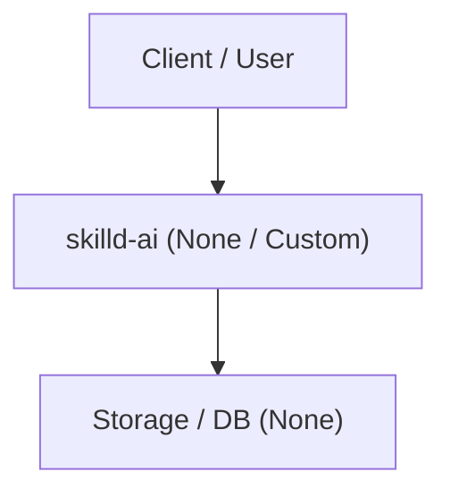

# 🏛️ System Architecture: skilld-ai

> Auto-generated by `skilld` CLI based on project scan.

---

## 1. Overview & Tech Stack

| Layer | Technology | Status |
| :--- | :--- | :---: |
| **Framework** | None / Custom | Active |
| **Language** | TypeScript | Active |
| **Database / ORM** | None | Active |
| **Package Manager** | pnpm | Active |

---

## 2. High-Level Architecture Diagram

